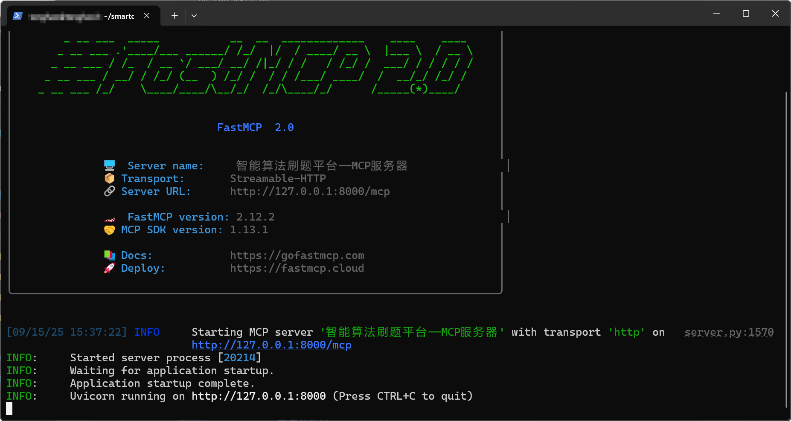
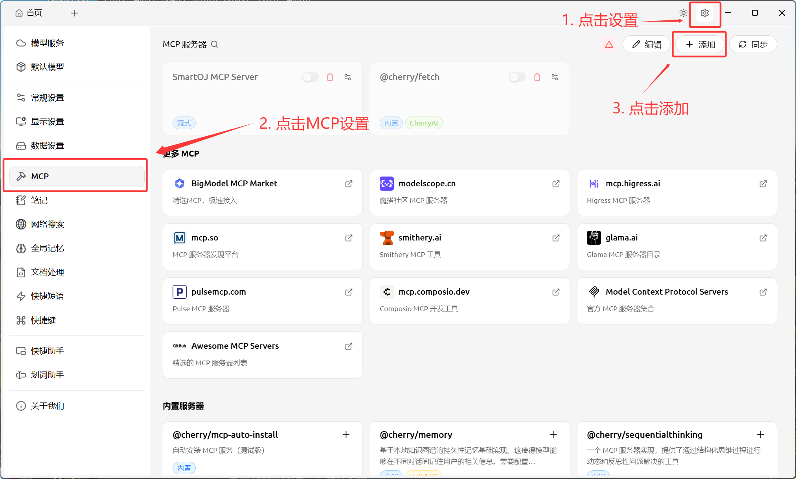
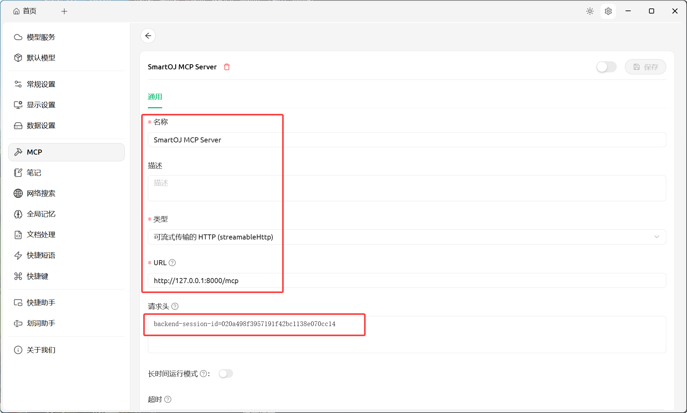
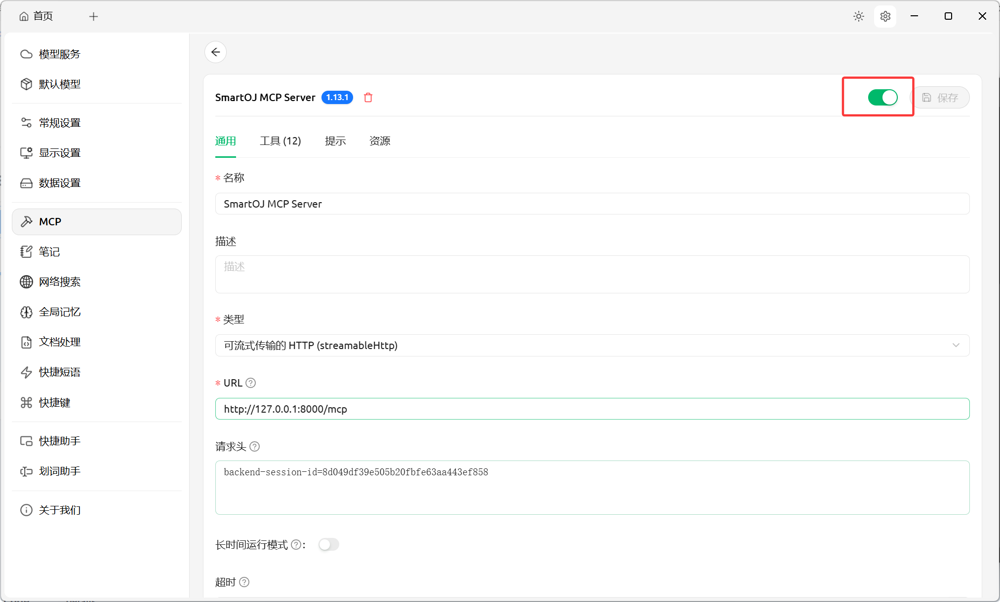
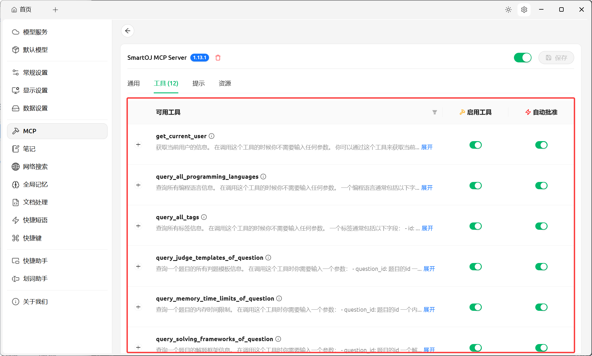
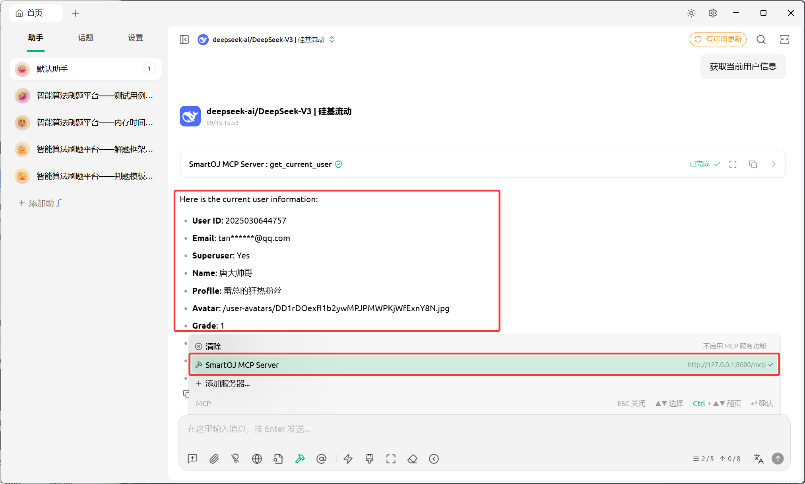

# 智能算法刷题平台——MCP 服务器代码仓库

## 🖼️仓库介绍

当前仓库是专门为智能算法平台而开发的，目的是为了能让大模型调用该项目的部分后端接口，以实现一些智能化的功能，例如：自动完善题库、自动规划用户的刷题路线、大模型自动判题等等功能。

## ❓相关问题

### 为什么不直接使用 FastMCP 直接将后端接口转换成 MCP 工具？

项目的后端是基于 FastAPI 框架进行构建，它的每一个接口天生符合 OpenAPI 接口规范，而 FastMCP 也支持直接从 OpenAPI 文档中直接定义 MCP 工具，因此该项目后端的每一个接口都可以直接使用 FastMCP 库转换成相应的 MCP 工具。

```python
from fastapi import FastAPI
from fastmcp import FastMCP

app = FastAPI()
mcp_server = FastMCP.from_fastapi(app=app)

if __name__ == "__main__":
    mcp.run()
```

官方文档：[FastAPI 🤝 FastMCP - FastMCP](https://gofastmcp.com/integrations/fastapi#generating-an-mcp-server)。

这个库极大程度上简化了开发的难度并减少了相应的开发成本，可以说几乎使用零成本就可以将后端的接口直接转换成 MCP 工具。

🤔但是为什么不推荐使用这样的方式转换呢？

经过仔细阅读 FastMCP 的官方文档，可以发现里面有一段这样的警告或建议：

> Generating MCP servers from OpenAPI is a great way to get started with FastMCP, but in practice LLMs achieve **significantly better performance** with well-designed and curated MCP servers than with auto-converted OpenAPI servers. This is especially true for complex APIs with many endpoints and parameters.We recommend using the FastAPI integration for bootstrapping and prototyping, not for mirroring your API to LLM clients. See the post [Stop Converting Your REST APIs to MCP](https://www.jlowin.dev/blog/stop-converting-rest-apis-to-mcp) for more details.

这段话主要想表达的意思是：直接使用 FastMCP 将后端接口转换成相应的 MCP 工具是一个非常便捷且高效的方式，但是人为编写一个高效且易于大模型理解的 MCP 服务器比直接使用这种方式得到的 MCP 服务器会更加高效且更有利于大模型调用。并且在最后给出了一篇文章来进一步加强这个建议的程度。

那篇文章的意思也很简单，它大概从以下几点来建议我们不要直接将 Restful 风格的 API 转换成大模型使用的工具：

1. **信息过载**：
   - REST API 通常提供大量细粒度、原子化的端点，适合人类开发者组合使用。
   - 对 LLM 来说，每个工具都会增加上下文负担（token 和延迟），导致决策困难。
2. **交互效率低**：
   - LLM 每次调用工具都需要完整的推理周期，链式调用多个小工具成本高昂。
   - 原子性对人友好，对 agent 是反模式。
3. **上下文污染**：
   - 工具过多会“淹没”模型，使其关注无关细节，偏离任务目标。
   - 导致模型变慢、变笨、更贵。

通过阅读这些信息，我仔细思考了一下现有的后端接口，确实有很多接口不应该给大模型来直接调用，因为有些接口的调用需要组合调用以及人为干预，一旦大模型出现调用失误，一方面对用户不友好，另一方面也有可能会暴露部分系统的敏感信息。

总的来说，现有的后端接口是按照人类能够理解的方式来编写的，但是大模型可能会无法理解这些接口的含义或者调用方式。而目前绝大多数知名 MCP 服务器也都是重新编写，而非直接使用相关的工具将相应的后端接口映射成 MCP 工具。例如：GitHub、百度地图等等知名 MCP 服务器。

所以按照现有的后端接口重新编写一个 MCP 服务器是一个较为正确且明智的选择。

## 📒使用说明

### 克隆代码并配置相关环境

1. 克隆代码。

   ```bash
   git clone git@github.com:SmartOnlineJudge/smartoj-mcp-server.git
   ```

2. 在本地安装 UV 包管理工具。

   项目使用 UV 来对 Python 包进行管理。因此需要先在本地安装好 UV 这个工具。

   >  UV 官方文档：[https://docs.astral.sh/uv/](https://docs.astral.sh/uv/)

3. 进入项目目录并安装相关依赖

   ```bash
   cd smartoj-mcp-server
   uv sync
   ```

4. 后端接口地址配置

   这个 MCP 服务器的本质是向后端的接口发送一个 HTTP 请求，然后将解析响应的过程封装成一个 MCP 工具。因此这里需要先配置一下后端的接口地址。

   > 后端代码仓库：[https://github.com/SmartOnlineJudge/smartoj-backend](https://github.com/SmartOnlineJudge/smartoj-backend)。

   在项目目录中找到`.env` 这个配置文件，然后将`BACKEND_URL`这个字段改为真实的后端地址：

   ```
   # 这里改成后端真实的接口地址
   BACKEND_URL = http://127.0.0.1:8000
   # 下面这个配置可以不用改
   BACKEND_SESSION_ID_NAME = backend-session-id
   ```

5. 启动 MCP 服务器

   项目默认以`可流式传输的HTTP` 的方式来启动 MCP 服务器。

   ```bash
   uv run main.py
   ```

   看到以下界面即代表 MCP 服务启动成功：

   

6. 权限认证配置与客户端设置

   在调用后端部分接口的时候需要使用到身份验证，这也就间接导致了调用部分 MCP 工具的时候也需要进行身份验证。后端身份认证的方式是 Cookie + Session。因此在配置 MCP 服务器的时候也需要提供一个认证的 Token，也就是`session_id`。

   这里以`Cherry Studio`客户端为例（其他的客户端也是类似的，主要注意请求头部分的参数）：

   

   

   这里主要针对以下两个字段：

   1. **URL**

      如果你是以 Stdio 的形式启动 MCP 服务的，那么你可以不用管。

      填写真实的 MCP 服务器地址，服务启动成功后会输出 MCP 的 URL。

   2. **请求头**

      权限认证通过请求头的方式来进行认证。

      如果你的`.env`配置中的`BACKEND_SESSION_ID_NAME`配置是默认的，那么请求头中的键名就与上述图片的保持一致；但是如果你的`BACKEND_SESSION_ID_NAME`配置修改过，那么需要填写你修改以后的值。

      请求头`backend-session-id`对应的值就是在系统登录以后，后端返回的`session_id`值。

   配置好以后保存配置，然后在`Cherry Studio`中连接这个 MCP 服务器：

   

   连接成功后就可以看到相关的工具列表了：

   

   然后为大模型添加相关的 MCP 服务器，就可以正常调用 MCP 工具了。

   

## 🔧工具列表

> **温馨提示**：
>
> 在让任何的大模型调用以下工具之前，最好先为大模型设置一个系统提示词，让它能够理解工具本身以及工具参数的含义。这样大模型才不会胡乱调用工具或者调用工具时传递错误的参数。
>
> 除此之外，最好每一种类型的工具都单独使用一个大模型并为其编写“独特”的提示词，这样效果会更好。例如：与判题模板相关的工具都交给模型 A 来处理；而解题框架相关的工具都交给模型 B 来处理。并根据工具的类型单独为这些模型编写一个“独特”的提示词。

<details>
    <summary>用户相关工具</summary>
    <ul>
        <li>
            <p>
                <strong>get_current_user - 获取当前用户信息</strong>
            </p>
            <p>不需要传递参数</p>
        </li>
    </ul>
</details>

<details>
    <summary>题目相关工具</summary>
    <ul>
        <li>
          <p><strong>query_question_info - 查询一个题目的详细信息</strong></p>
          <p>
            <ul>
              <li><code>question_id</code>：题目ID（整型，必须）</li>
            </ul>
          </p>
        </li>
        <li>
          <p><strong>create_question - 创建一道新题目</strong></p>
          <p>
            <ul>
              <li><code>title</code>：题目的名称（字符串，必须）</li>
              <li><code>description</code>：题目的描述（字符串，必须）</li>
              <li><code>difficulty</code>：题目的难度（字符串，必须，且只能是这三个值：easy, medium, hard）</li>
              <li><code>tags</code>：题目的所有标签（整型列表，必须，列表元素是标签ID）</li>
            </ul>
          </p>
        </li>
    </ul>
</details>

<details>
  <summary>判题模板相关工具</summary>
  <ul>
    <li>
      <p><strong>query_judge_templates_of_question - 查询一个题目的所有判题模板</strong></p>
      <p>
	    <ul>
          <li><code>question_id</code>：题目ID（整型，必须）</li>
        </ul>
        </p>
    </li>
    <li>
      <p>
        <strong>
          create_judge_template_for_question - 为指定题目指定编程语言创建一个判题模板
        </strong>
      </p>
      <p>
        <ul>
          <li><code>question_id</code>：题目ID（整型，必须）</li>
          <li><code>language_id</code>：编程语言ID（整型，必须）</li>
          <li><code>code</code>：判题模板的代码（字符串，必须）</li>
        </ul>
      </p>
    </li>
    <li>
      <p>
        <strong>
          update_judge_template_for_question - 更新一个题目的判题模板
        </strong>
      </p>
      <p>
        <ul>
          <li><code>question_id</code>：题目ID（整型，必须）</li>
          <li><code>judge_template_id</code>：判题模板ID（整型，必须）</li>
          <li><code>code</code>：判题模板的代码（字符串，必须）</li>
        </ul>
      </p>
    </li>
  </ul>
</details>

<details>
  <summary>编程语言相关工具</summary>
  <ul>
    <li>
      <p><strong>query_all_programming_languages - 查询系统所有编程语言信息</strong></p>
      <p>不需要传递参数</p>
    </li>
  </ul>
</details>

<details>
  <summary>内存时间限制相关工具</summary>
  <ul>
  	<li>
      <p><strong>query_memory_time_limits_of_question - 查询一个题目的内存时间限制</strong></p>
      <p>
        <ul>
          <li><code>question_id</code>：题目ID（整型，必须）</li>
        </ul>
      </p>
    </li>
    <li>
      <p><strong>create_memory_time_limit_for_question - 为指定题目指定编程语言创建一个内存时间限制</strong></p>
      <p>
        <ul>
          <li><code>question_id</code>：题目ID（整型，必须）</li>
          <li><code>language_id</code>：编程语言ID（整型，必须）</li>
          <li><code>memory_limit</code>：内存限制，单位 MB（整型，必须）</li>
          <li><code>time_limit</code>：时间限制，单位 ms（整型，必须）</li>
        </ul>
      </p>
    </li>
    <li>
      <p><strong>update_memory_time_limit_for_question - 更新一个题目的内存时间限制</strong></p>
      <p>
        <ul>
          <li><code>question_id</code>：题目ID（整型，必须）</li>
          <li><code>memory_time_limit_id</code>：需要修改的内存时间限制ID（整型，必须）</li>
          <li><code>memory_limit</code>：内存限制，单位 MB（整型，必须）</li>
          <li><code>time_limit</code>：时间限制，单位 ms（整型，必须）</li>
        </ul>
      </p>
    </li>
  </ul>
</details>

<details>
  <summary>标签相关工具</summary>
  <ul>
  	<li>
      <p><strong>query_all_tags - 查询系统所有标签信息</strong></p>
      <p>不需要传递参数</p>
    </li>
  </ul>
</details>

<details>
  <summary>解题框架相关工具</summary>
  <ul>
  	<li>
      <p><strong>query_solving_frameworks_of_question - 查询一个题目的解题框架信息</strong></p>
      <p>
        <ul>
          <li><code>question_id</code>：题目ID（整型，必须）</li>
        </ul>
      </p>
    </li>
	  <li>
      <p><strong>create_solving_framework_for_question - 为指定题目指定编程语言创建一个解题框架</strong></p>
      <p>
        <ul>
          <li><code>question_id</code>：题目ID（整型，必须）</li>
          <li><code>language_id</code>：编程语言ID（整型，必须）</li>
          <li><code>code_framework</code>：解题框架的代码（字符串，必须）</li>
        </ul>
      </p>
    </li>
    <li>
      <p><strong>update_solving_framework_for_question - 更新一个题目的解题框架</strong></p>
      <p>
        <ul>
          <li><code>question_id</code>：题目ID（整型，必须）</li>
          <li><code>solving_framework_id</code>：解题框架ID（整型，必须）</li>
          <li><code>code_framework</code>：解题框架的代码（字符串，必须）</li>
        </ul>
      </p>
    </li>
  </ul>
</details>

<details>
  <summary>测试用例相关工具</summary>
  <ul>
  	<li>
      <p><strong>query_tests_of_question - 查询一个题目的所有测试用例信息</strong></p>
      <p>
        <ul>
          <li><code>question_id</code>：题目ID（整型，必须）</li>
        </ul>
      </p>
    </li>
	<li>
      <p><strong>create_test_for_question - 为指定题目创建一个测试用例</strong></p>
      <p>
        <ul>
          <li><code>question_id</code>：题目ID（整型，必须）</li>
          <li><code>input_output</code>：测试用例的输入输出信息（字符串，必须）</li>
        </ul>
      </p>
    </li>
  </ul>
</details>
